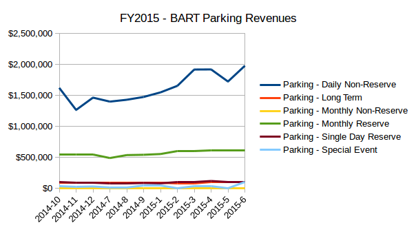

This is a project to host the open data and analysis about the Bay Area Regional Transit system budget. The goal is to demonstrate how useful it would be to publish this information monthly as part of an open data portal. 

**status**: waiting to hear from from BART to clarify ...
1. how this data corelates to the audited financials. 
2. meaning of the account descriptions

### Data
The data was obtained by sending a FOIA request for the line item data for every transaction bart made in Fiscal Year 2015. BART delievered their response on Sept 15th, 2016, in 12 excel files containing the data. 

### Get Started

Python Users:
All you need is jupyter and pandas to get started. 

Excel Users:
Start with the [summary file](data/income_expenses_FY2015/summary_income_expenses_FY2015.xlsx). The raw data is too large for a spreadsheet.

### FY2015 Stats
* Senior Citizen revenues are 20x that of from students.
* Fiber optic revenue: ~$4 million 
* Parking revenue: $29 million
* Parking costs: $1 million
* more to come

